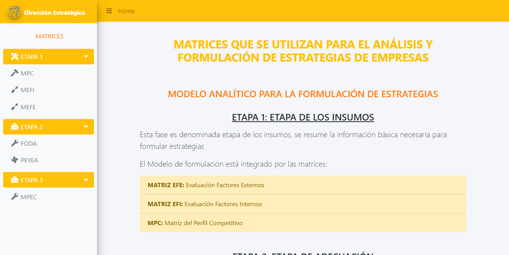
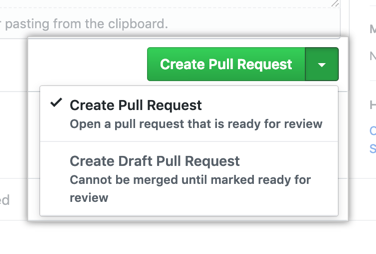

# Análisis y Formulación de estrategias

[](https://www.matricesestrategicas.com)

**_Aplicación web_** que consta de una serie de **_matrices estratégicas_** que son un conjunto de herramientas analíticas las cuales nos ayuda a seleccionar la estrategia adecuada de cada uno de los productos/servicios de la empresa.

La mayoría de las matrices estratégicas representan el posicionamiento que tiene nuestra empresa a través de sus productos/servicios o líneas de negocio frente a la competencia, gracias a esta comparativa y teniendo en cuenta otros factores que influyen en el éxito de la empresa nos ayudará a tomar la mejor decisión a nivel de estrategia corporativa.

Existen diversas [_matrices estratégicas_](https://slideplayer.es/slide/13899379/85/images/23/Modelo+analítico+para+la+formulación+de+estrategias.jpg) que realizan su análisis bajo diferentes puntos de vista, entre las más importantes podemos citar las siguientes:

_Etapa 1: Etapa de los insumos_
* Matriz MPC
* Matriz MEFI
* Matriz MEFE

_Etapa 2: Etapa de adecuación_
* Matriz FODA
* Matriz PEYEA

_Etapa 3: Etapa de desición_
* Matriz MPC

**LENGUAJES DE PRGORAMACIÓN USADOS:**
Lenguajes |
------------ | 
React | 
Boostrap |

**ENLACES PARA ENTENDER MEJOR LA APP:**
* [Tutorial sobre la aplicación](https://www.youtube.com/watch?v=XeAfkhQOBUA)

## Cómo Contribuir Al Proyecto? 
1. Hacer fork del proyecto

    

2. Clonar rama fork
    ```git
      git clone https://github.com/_nameuser_/Matrices-Estrategicas.git
    ```
3. Instalar los paquetes especificados

   ```bash
      npm install
   ```
4. Ejecutar aplicación
   ```bash
      npm run dev
   ```
5. Realizar cambios y pushearlos
    ```git
      git push origin main
    ```
6. Comparar y crear PR

   
  
7. A esperar el mergeo del PR ✿◡‿◡

**IMPORTANTE:** Para correr esta aplicación tienes que tener instalado _NodeJS_

## Acerca de los PRs
  * **No hagas PRs para refactorizar código o cambiar la estructura del proyecto (carpetas)**, la idea es añadir más funcionalidades
  * **No hagas PRs abismales**, lo recomendado es hacer PRs lo más atómico y refactorizado posible 
  * **Puedes añadir PRs que mejore el aspecto visual** :satisfied:

## Recomendaciones de cambios que puedes realizar
- [ ] Cambiar Theme :two_hearts:
- [ ] Modo Oscuro :last_quarter_moon:
- [ ] Añadir Matriz del Boston Consulting Group(BCG)
- [ ] Añadir Matriz interna-externa (IE)
- [ ] Añadir Matriz de la estrategia principal


  


